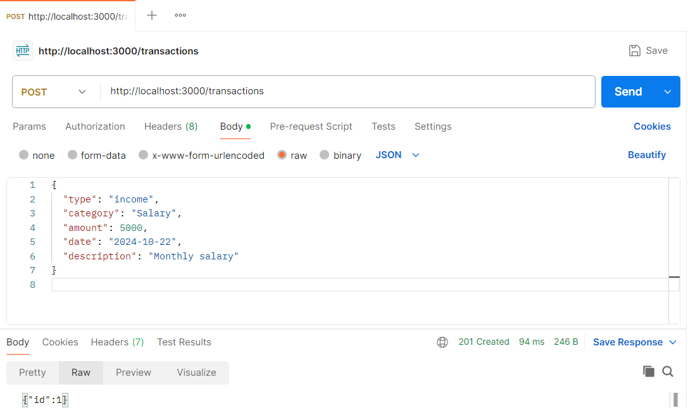
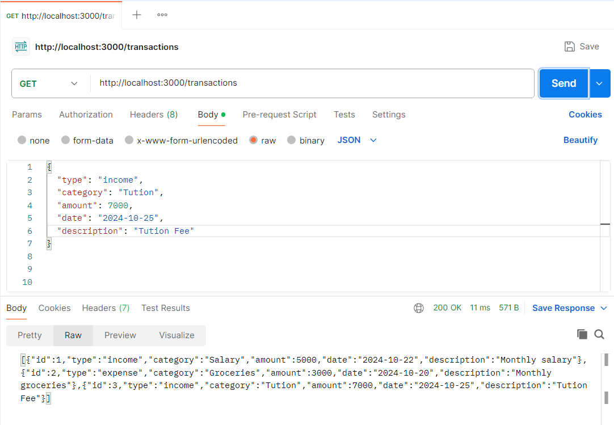
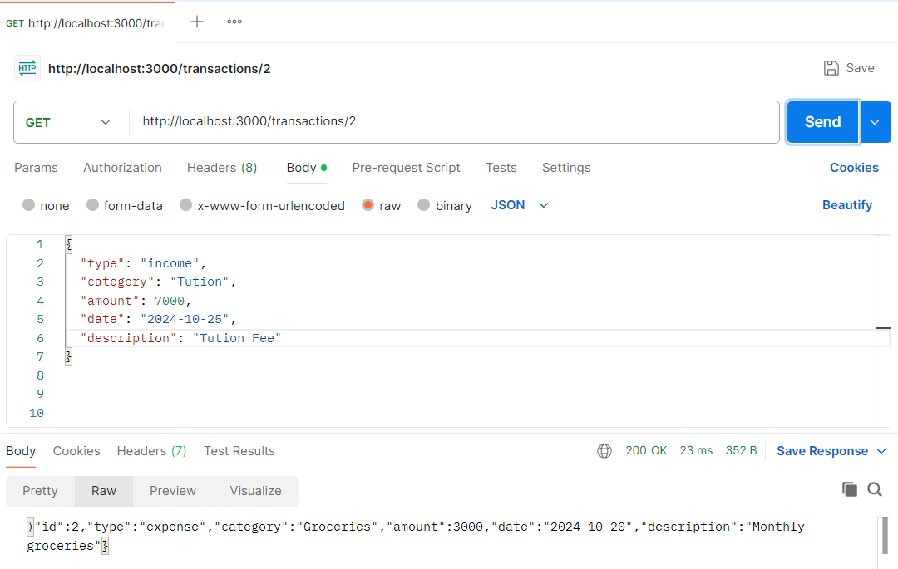
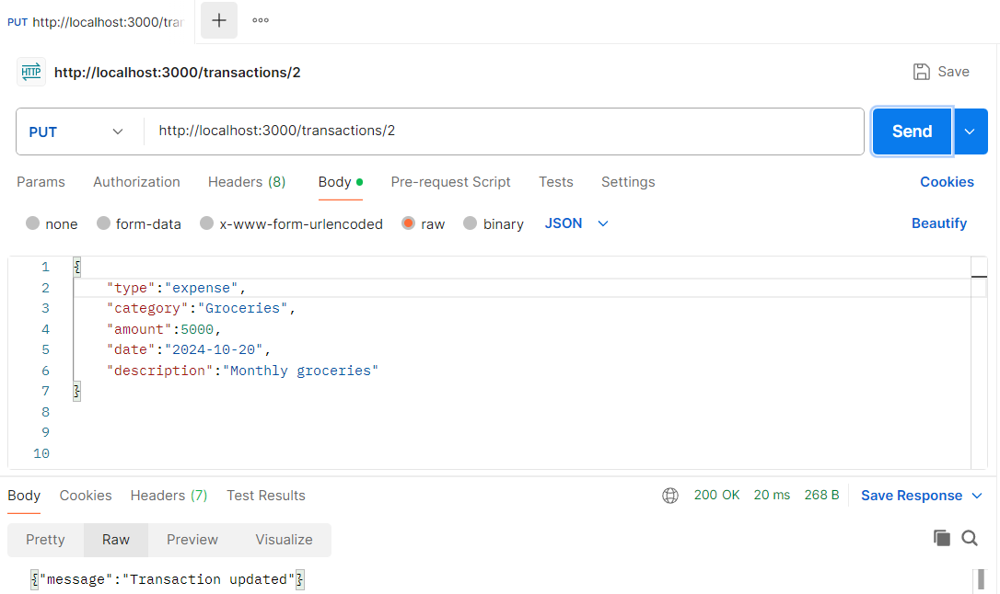
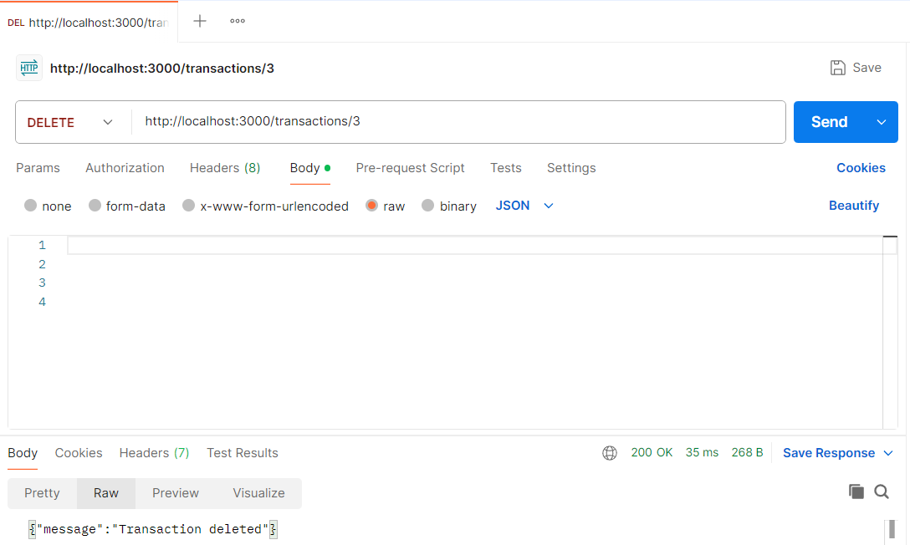
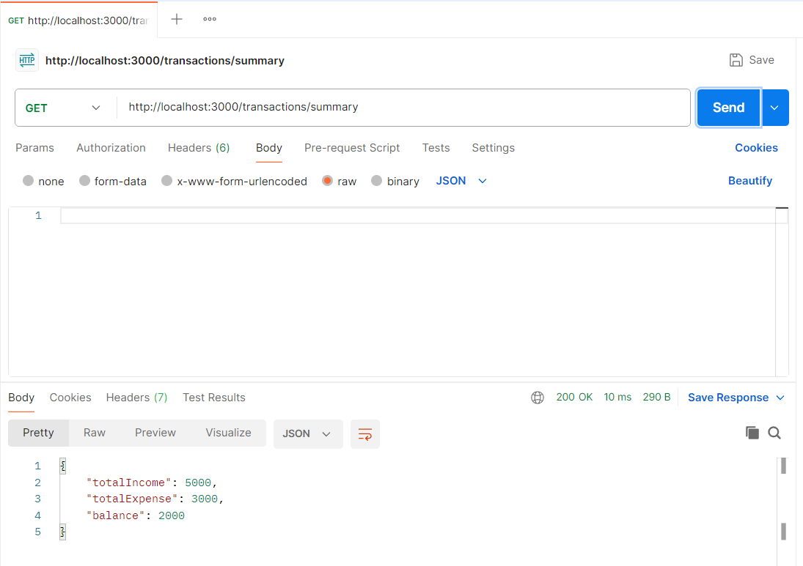

# Personal Expense Tracker API

This project is a simple RESTful API for managing personal financial records, built with Node.js and Express.js using SQLite for the database.

1. Inititalize the project
   a) npm init -y (inside the directory)

2. Create the db files:
   a) ```mkdir db```
   b) touch db/database.db

3. Run the app:
   ```node app.js```


## Documentation

For detailed API documentation, see the [API Documentation](.api_docs.txt).


## Postman Screenshots

1. `POST /transactions: Adds a new transaction (income or expense).`


2. `GET /transactions: Retrieves all transactions.`


3. `GET /transactions/:id: Retrieves a transaction by ID.`


4. `PUT /transactions/:id: Updates a transaction by ID.`


5. `DELETE /transactions/:id: Deletes a transaction by ID.`


6. `GET /summary: Retrieves a summary of transactions, such as total income, total expenses, and balance.`

